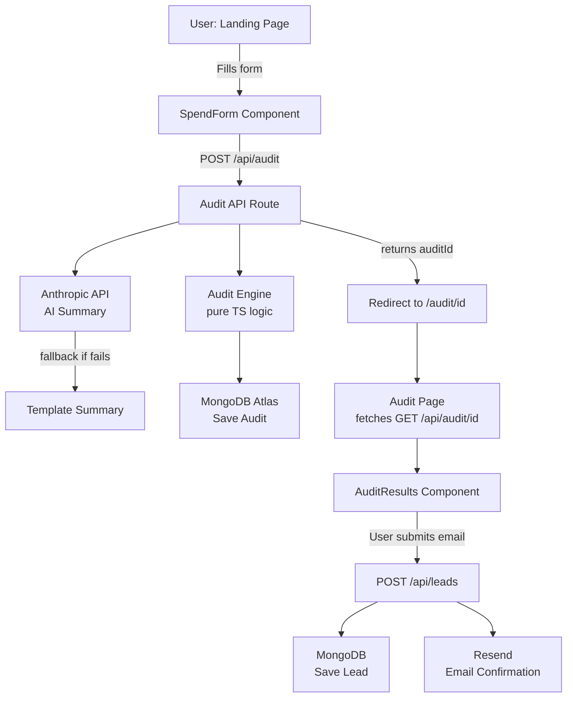

# Architecture

## System Diagram

## Data Flow

1. User fills `SpendForm` (persisted to `localStorage` on every change)
2. On submit → `POST /api/audit` with `{ formData, honeypot }`
3. API route runs rate limit check + honeypot check
4. `runAudit(formData)` executes all rule checks per tool, picks highest-saving recommendation
5. `generateAISummary()` calls Anthropic API → falls back to template on error
6. Full audit object saved to MongoDB with a UUID
7. API returns `{ auditId }` → browser redirects to `/audit/:id`
8. `/audit/:id` page fetches audit via `GET /api/audit/:id` (email/company stripped)
9. Page renders results + `LeadCapture` component
10. On email submit → `POST /api/leads` → saves to MongoDB + sends Resend email

## Stack Choices

| Layer | Choice | Reason |
|---|---|---|
| Framework | Next.js 14 App Router | Full-stack in one repo, one Vercel deploy, built-in OG image support |
| Language | TypeScript | End-to-end type safety, catches bugs at compile time |
| Styling | Tailwind CSS | Fast iteration, consistent design tokens, no CSS bloat |
| Database | MongoDB Atlas | Variable-shape audit documents, free tier generous, Mongoose for type safety |
| Email | Resend | Simplest transactional email API, excellent DX, free tier 100/day |
| AI | Anthropic claude-haiku-4-5 | Cheapest Anthropic model, fast, sufficient for 100-word summaries |
| Tests | Vitest | Native ESM, fast, TypeScript-first |
| CI | GitHub Actions | Required by assignment, standard |
| Deploy | Vercel | Zero-config Next.js, free tier, automatic preview URLs |

## Scaling to 10k Audits/Day

Current architecture handles ~100/day comfortably. For 10k/day:

1. **Rate limiting** → Move from in-memory to Upstash Redis (stateless, survives cold starts)
2. **AI summary** → Queue with BullMQ/Inngest — generate async, poll or use webhooks
3. **MongoDB** → Add indexes on `createdAt`, `email`; consider read replicas for audit page fetches
4. **Vercel** → Already scales horizontally; move to Pro for higher function concurrency limits
5. **Email** → Resend free tier (100/day) → Resend Pro or SES for volume
